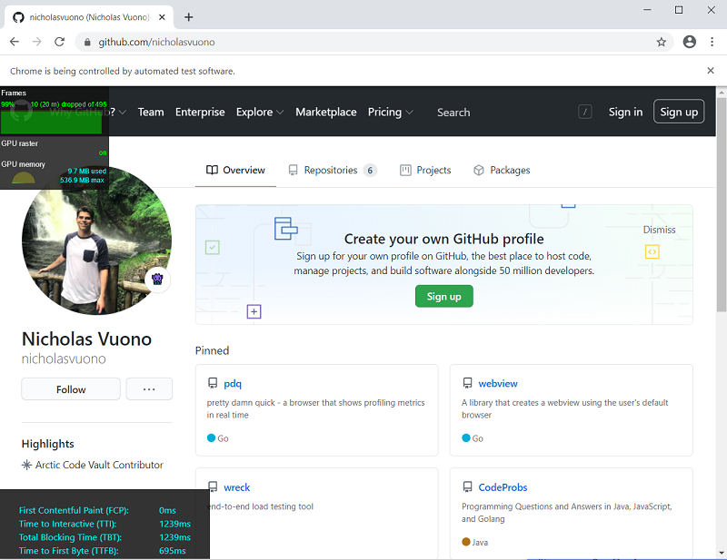

# pdq

Pretty Damn Quick - a performance browser that shows profiling metrics in real time

The goal of this project is to design a performance tool that replaces the traditional profiling practice of recording workflows in favor of realtime metrics.

## Features

* Pure Go implementation
* Cross-platform executables (Windows, Mac, Linux)
* Displays reat-time frontend performance metrics:
    * Frames and GPU
    * Page Load Time:
        * First Contenful Paint
        * Time to Interactive
        * Total Blocking Time
        * Time to First Byte
    * Memory:
        * DOM Nodes
        * Used Memory Percentage

## What?

A Browser to replace traditional frontend profiling. This browser is designed to be a development tool that allows users to keep web application performance in mind. It does this by displaying the most important frontend performance metrics in real-time. 

## Why?

Traditional forntend performance testing usually requires the use of tools like Chrome Developer Tools, Page Speed Insights, Lighthouse, and more. Tools that are used to capture the performance of workflows (i.e., Chrome Developer Tools) usually need the user to record a workflow and sort through a pile of data to find meaningful insights. Tools that are used to capture the performance of page load time (i.e., Lighthouse) usually require an audit of some sort that that make you wait for results after you click the button. Now these tools are great at what they do, but they take away from the development process by having developer open up a separate profiling tool or navigate to another website to copy and paste their web application link. Wouldn't it be easier if related profiling metrics were displayed in real-time in the browser they were already using to develop their web application without any additional steps?

## Research behind the tool

Might write an article on this in the future but for now here are some important links with some important frontend performance metrics and guidelines:

* https://web.dev/rail/
* https://web.dev/user-centric-performance-metrics/
* https://www.nngroup.com/articles/response-times-3-important-limits/
* https://httparchive.org/reports/loading-speed

## Examples and Screenshots

